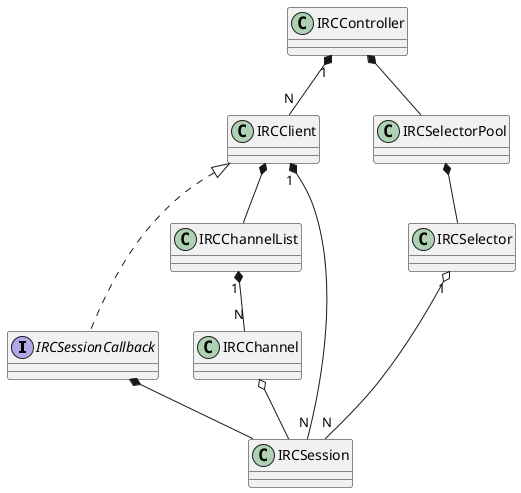

# IRC Class Flow

```plantuml
@startuml
interface IRCSessionCallback
IRCController "1" *-- "N" IRCClient
IRCController *-- IRCSelectorPool
IRCClient *-- IRCChannelList
IRCChannelList "1" *-- "N" IRCChannel
IRCChannel o-- IRCSession
IRCClient "1" *-- "N" IRCSession
IRCClient <|.. IRCSessionCallback
IRCSessionCallback *-- IRCSession
IRCSelectorPool *-- IRCSelector
IRCSelector "1" o-- "N" IRCSession
@enduml
```
