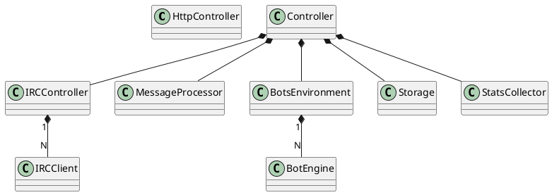
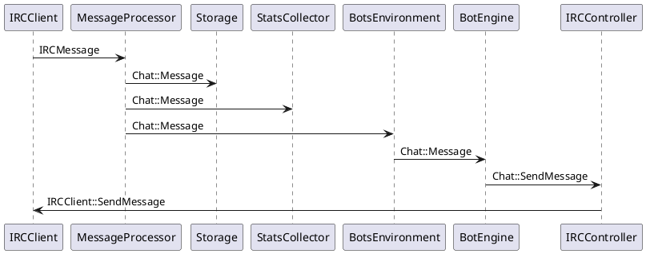
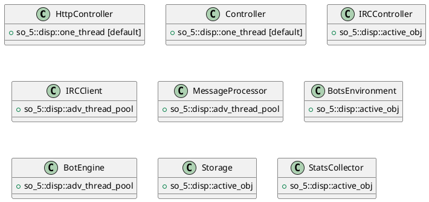

# so_5::agent flow

```plantuml
@startuml
class HttpController
Controller *-- IRCController
Controller *-- MessageProcessor
Controller *-- BotsEnvironment
Controller *-- Storage
Controller *-- StatsCollector
IRCController "1" *-- "N" IRCClient
BotsEnvironment "1" *-- "N" BotEngine
@enduml
```

# so_5::message flow

```plantuml
@startuml
IRCClient -> MessageProcessor : IRCMessage
MessageProcessor -> Storage : Chat::Message
MessageProcessor -> StatsCollector : Chat::Message
MessageProcessor -> BotsEnvironment : Chat::Message
BotsEnvironment -> BotEngine : Chat::Message
BotEngine -> IRCController : Chat::SendMessage
IRCController -> IRCClient : IRCClient::SendMessage
@enduml
```

# so_5::thread flow

```plantuml
@startuml
class HttpController {
+so_5::disp::one_thread [default]
}
class Controller {
+so_5::disp::one_thread [default]
}
class IRCController {
+so_5::disp::active_obj
}
class IRCClient {
+so_5::disp::adv_thread_pool
}
class MessageProcessor {
+so_5::disp::adv_thread_pool
}
class BotsEnvironment {
+so_5::disp::active_obj
}
class BotEngine {
+so_5::disp::adv_thread_pool
}
class Storage {
+so_5::disp::active_obj
}
class StatsCollector {
+so_5::disp::active_obj
}
@enduml
```
